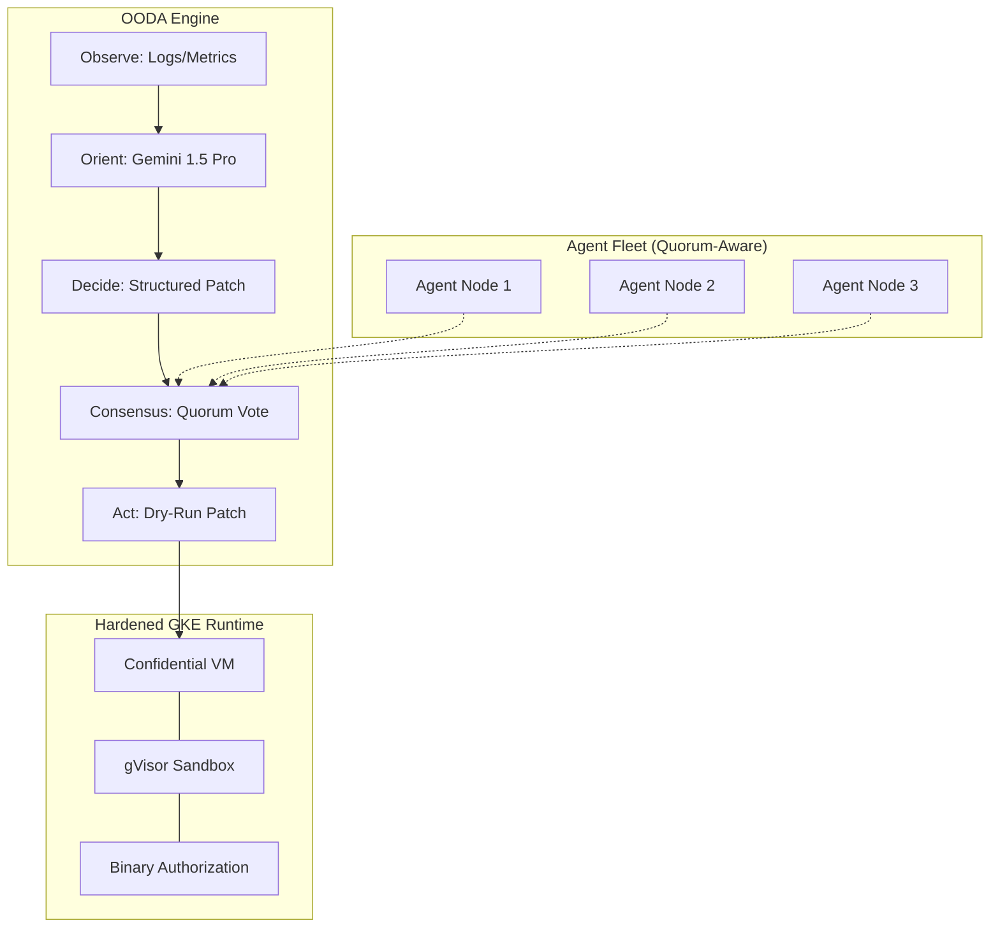

# Agentic Incident Analyzer – Multi-Agent Consensus Research PoC


**Agentic Incident Analyzer (v3.7.1)** is a research framework for **Informed SRE Autonomy**. It demonstrates a self-healing cloud control plane that remains resilient against telemetry corruption and agent-level instability using a **Quorum-Based Consensus** model.

## 🏛️ Architecture: The OODA Consensus Loop



> [!IMPORTANT]
> **Research Disclaimer**: This is a **Simplified Quorum Prototype**. While it demonstrates distributed agreement, it is designed for demonstrating **Architectural Patterns** of agentic resilience rather than providing financial-grade consistency.

## 🚀 Demo: Resilience in Action

### 1. The Happy Path (`make demo`)
*Agent observes OOM, Orientates via Gemini, Decides on a patch, and Validates via Dry-Run.*

### 2. The Chaos Path (`make chaos`)
*Agent observes "Liar's Payload" (Corrupted Logs). Quorum detects dissonance and aborts.*

```text
$ make chaos
🚀 AGENTIC SRE DEMO v3.7.1 [CHAOS MODE]
🛡️  Step 1: Performing Hardware-Rooted Attestation...
✅ SUCCESS: Environment verified (SEV-SNP / GKE Sandbox enabled).

📡 Step 2: OBSERVE - Ingesting incident logs...
⚠️  [CHAOS] Byzantine Fault Injected: Logs have been corrupted to 'False Healthy'.

🧠 Step 3: ORIENT/DECIDE - Escalating to Gemini 1.5 Pro...
   [CAU]: False Healthy (System reports OK in logs)
   [ACT]: MONITOR_AND_WAIT

🛡️  Step 4: CONSENSUS - Byzantine Fault Detected!
   Dissonance found between Metrics (OOM) and Corrupted Logs (Healthy).
   [RESULT]: Quorum REJECTED remediation. Fail-safe triggered.
```

### 🛠️ Core Engineering Depth
1.  **Multi-Agent Consensus**: A quorum-based agreement layer to prevent "Single Agent Failure" catastrophic changes.
2.  **Actionable AI**: Gemini 1.5 Pro generating structured **Kubernetes JSON Patches** via Function Calling.
3.  **Observability**: **OpenTelemetry (OTEL)** instrumentation for OODA loop tracing.
4.  **Hardened GKE Infrastructure**: Terraform with **Confidential Nodes** and **gVisor** enabled.

### 🛤️ Active R&D
- [ ] **Multi-Cluster Quorum**: Extending agreement across disparate GCP Regions.
- [ ] **Adaptive Chaos**: AI-driven fault injection based on historical failure patterns.
- [ ] **TPU Acceleration**: Scaling local analyzer tiers for millisecond-latency reasoning.

---
**Disclaimer**: This is a professional development portfolio designed to demonstrate distributed systems thinking and GCP-native engineering.
