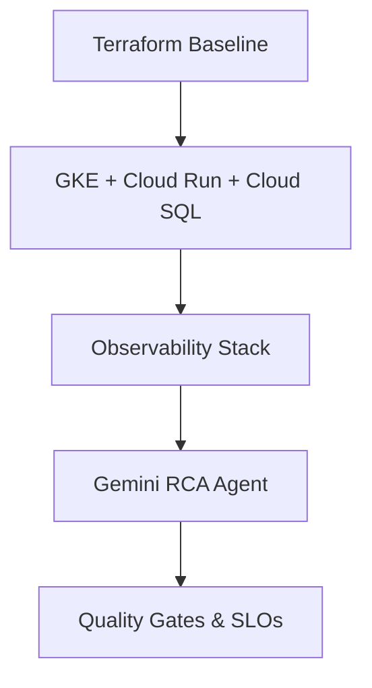

# GCP QE Architecture

Practical, production-focused Quality Engineering patterns for Google Cloud Platform.

**Best for**: QA Architects, SREs, Platform Teams working on GKE, Cloud Run, and modern AI workloads.

Focused on **GKE, Cloud Run, Cloud SQL, Observability, Resilience**, and **Modern AI Quality** (Gemini Agents + Agentic AI / RAG / MCP).

### Why This Repo Exists
I built this as a living reference while working as **QA Architect Manager** on GCP. It contains patterns I actually use and refine.

### Quick Navigation

- [Case Studies](case-studies/) 🚀
- [Real-World Usage](docs/real-world-usage.md)
- [Lessons Learned](docs/lessons-learned.md)
- [Modular Terraform Baseline](reference-implementations/terraform-baseline/)
- [Cloud Build Quality Pipeline](reference-implementations/cloud-build-pipelines/)
- [End-to-End Observable Example](examples/end-to-end-observable-app/)
- [Service Guides](guides/)
- [AI Frameworks](frameworks/)
- [Tools](tools/)
- [Patterns & Checklists](patterns/)
- [Evidence & Outputs](evidence/)

### Current Maturity (Day 21)
- **Modular Terraform Baseline**: Production-ready and automated.
- **CI/CD Quality Pipeline**: Cloud Build integrated with k6 and Gemini.
- **Gemini + Agentic AI tools**: RCA and RAG evaluation working.
- **Patterns & Checklists Library**: 5+ high-level architect patterns.
- **End-to-End Example**: Fully connected flow from IaC to Observability.

### Future Roadmap
- [ ] Integration with GKE Autopilot & Gateway API patterns.
- [ ] Automated Chaos experiments in Cloud Build.
- [ ] Expansion of MCP Server QA framework with more tool-calling tests.
- [ ] Advanced RAG evaluation using Vertex AI Gen AI Evaluation service.

### How to Use This Repo
1. **Explore the Guides**: Start with [guides/](guides/) to understand the service-specific quality strategy.
2. **Review the Baseline**: Check the [Modular Terraform Baseline](reference-implementations/terraform-baseline/) for the infra foundation.
3. **Run the Tools**: Use the [Tools](tools/) for defect analysis or AI RCA.
4. **Follow the Checklist**: Use the [Production Readiness Checklist](patterns/production-readiness-checklist.md) for your own projects.

**📖 Documentation Site**: [https://anandkrshnn-ai.github.io/gcp-qe-architecture/](https://anandkrshnn-ai.github.io/gcp-qe-architecture/)

## 30-Day Improvement Plan Completed
Started: May 2026  
Completed: May 2026  

This repository is now a living, practical reference for GCP Quality Engineering.

### Disclaimer
Personal reference repository. All code and patterns should be reviewed and tested thoroughly in your own environment. No warranties.

**Last Updated:** May 2026

---

Made by Anandakrishnan – QA Architect Manager
