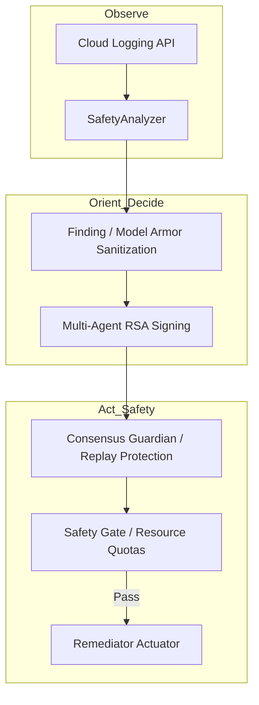

# Agent Safety Patterns for Multi-Agent Systems on GCP

**Principal Architect Reference Implementation (v8.2.0)**

**The Thesis**: Autonomous agents in multi-agent systems lack deterministic governance, leading to high-risk hallucinations and unverified state-changes. This repository enforces a **layered, verifiable safety core** using multi-agent cryptographic consensus and deterministic resource boundaries. Success is defined by achieving **100% verifiability of autonomous actions** with zero unauthorized state-changes.

---

Hardened framework for cryptographic consensus, resource-aware safety gates, and Model Armor sanitization for autonomous agents on Google Cloud Platform.

## 🛡️ Problem Statement
Autonomous agents can exhibit destructive behaviors if left ungoverned. This repository demonstrates a layered, verifiable safety architecture that enforces multi-agent consensus and deterministic resource boundaries before any state-changing operation occurs.

## 🚀 Core Safety Patterns
1. **Cryptographic Consensus**: Every remediation proposal must be signed by an RSA-PSS majority quorum using unique nonces for replay protection.
2. **Deterministic Safety Gates**: Agent proposals are validated against strict resource quotas (GCP-scale limits) and cost boundaries.
3. **Model Armor Sanitization**: Integrated leak-detection scanning to prevent PII or credential leakage in agent-to-agent communication.
4. **Resilient Vertex AI**: Production-grade Gemini 1.5 Pro integration with exponential backoff retries and exhaustive safety filters.

## 🛠 Quick Start
```bash
# Install dependencies (including tenacity, vertexai)
pip install -e .[gcp,dev]

# Run production-grade simulation
python run_demo.py

# Run with Real Vertex AI (requires GCP ADC)
python run_demo.py --real --project YOUR_PROJECT_ID
```

## 🏗 Architecture
The OODA loop (Observe, Orient, Decide, Act) is hardened with cryptographic checkpoints and safety-first actuation.



## 🧪 Verification
The system is verified using:
- **Property-Based Testing**: Validating consensus resilience under clock-skew and nonce collision scenarios.
- **End-to-End Integration**: Full Analysis -> Consensus -> Safety pipeline verification.
- **Standardized Logging**: Structured, high-fidelity audit trails without cryptographic leakage.

## 📝 Compliance & Safety
- **Vertex AI Safety Filters**: BLOCK_ONLY_HIGH thresholds for professional autonomy.
- **Data Privacy**: Local Model Armor redaction of GCP API keys and secrets.

**Status**: Principal-Grade Reference Implementation.
