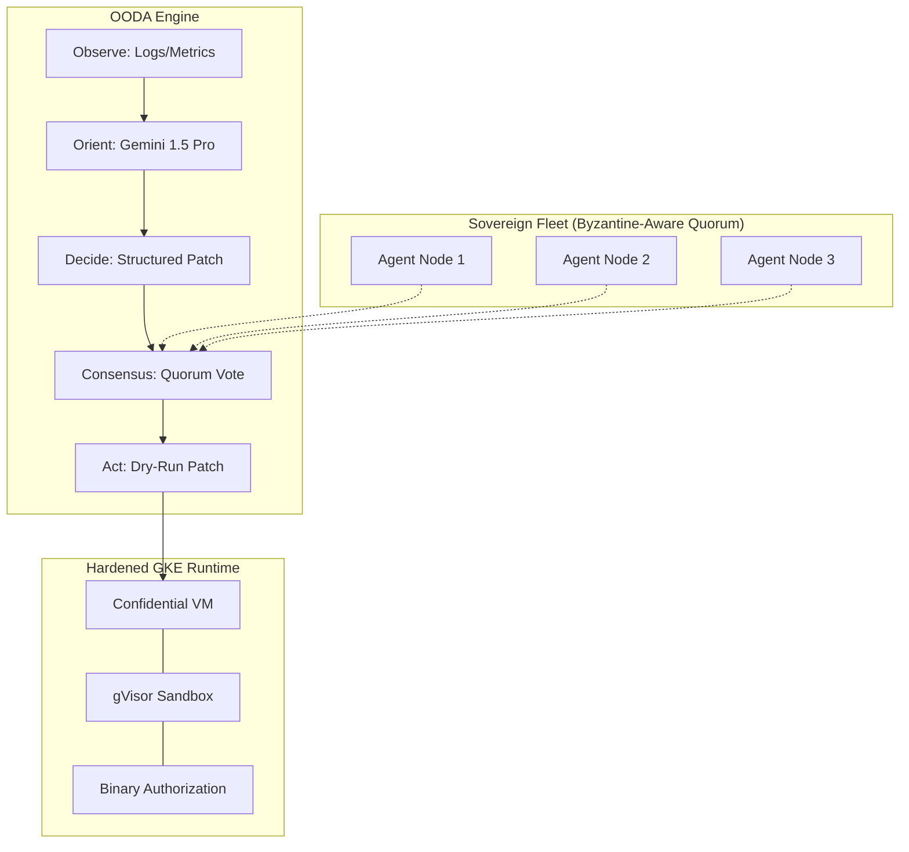

# Agentic Incident Analyzer with Multi-Agent Consensus (PoC)

**Sovereign-GCP (v3.5.0)** is a research framework for **Informed SRE Autonomy**. It demonstrates a self-healing cloud control plane that remains resilient against telemetry corruption and agent-level instability using a **Quorum-Based Consensus** model.

## 🏛️ Architecture: The OODA Consensus Loop

> [!IMPORTANT]
> **Research Disclaimer**: This is a **Simplified Quorum Prototype**. While it demonstrates distributed agreement, it is designed for demonstrating **Architectural Patterns** rather than providing financial-grade PBFT consistency.

### 🛠️ Current Capabilities (The Reality)
1.  **Simplified PBFT Prototype (v3.4.0)**: A research-grade consensus layer for agent agreement (Research Implementation).
2.  **Merkle-Chained WAL**: Cryptographically immutable state logging.
3.  **Hardened GKE Infrastructure**: Terraform with **Confidential Nodes** and **gVisor** enabled.
4.  **Agentic SRE Utility**: Gemini 1.5 Pro **Function Calling** with **Kubectl Patch** generation and **Dry-Run Validation**.

### 🛤️ The Path to "Principal" Depth (Active R&D)
- [ ] **Hardware Trust**: Moving from standard nodes to GKE Confidential Computing (SEV-SNP).
- [ ] **Real AI**: Replacing regex-based logic with Vertex AI (Gemini 1.5 Pro) for multimodal log/metric reasoning.
- [ ] **Policy Enforcement**: Integrating Binary Authorization for all agent images.

---
**Disclaimer**: This is a professional development portfolio designed to demonstrate distributed systems thinking and GCP-native engineering. All "Demo Reports" are generated within this PoC's controlled environment.
