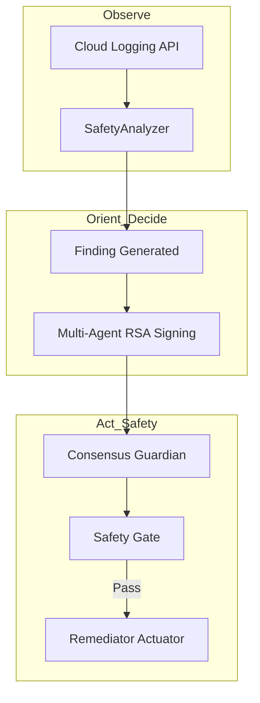

# Agent Safety Patterns for Multi-Agent Systems on GCP

**Research Proof-of-Concept (v7.0.0)**

Focused exploration of cryptographic consensus, resource quotas, and runtime attestation as safety mechanisms for autonomous agents.

## Problem Statement
Single-agent systems can hallucinate or act destructively. This PoC demonstrates layered, verifiable safeguards for autonomous operations on Google Cloud.

## Core Patterns
1. **Cryptographic Consensus**: Decisions are validated by an RSA-signed quorum of independent agents before any action is taken.
2. **Deterministic Safety Gates**: Agent-generated proposals are validated against strict resource quotas (CPU, Memory, Replicas) before execution.
3. **Verifiable Attestation**: Every decision creates a signed, non-repudiable audit trail for human triage.

## Quick Start
```bash
pip install -r requirements.txt
python run_demo.py
# or
python run_demo.py --real
```

## Architecture
The OODA loop (Observe, Orient, Decide, Act) is hardened with cryptographic checkpoints.



## Limitations & Roadmap
- Currently simulation-heavy for PoC portability.
- Next: Real Vertex AI integration + Google Model Armor.
- Not for production use.

## Related Work
- [LangGraph](https://github.com/langchain-ai/langgraph)
- [Google Cloud Model Armor](https://cloud.google.com/model-armor)
- [NVIDIA OpenShell (Secure Agentic Runtime)](https://github.com/NVIDIA/openshell)

**Status**: Research PoC — Not for production use.
