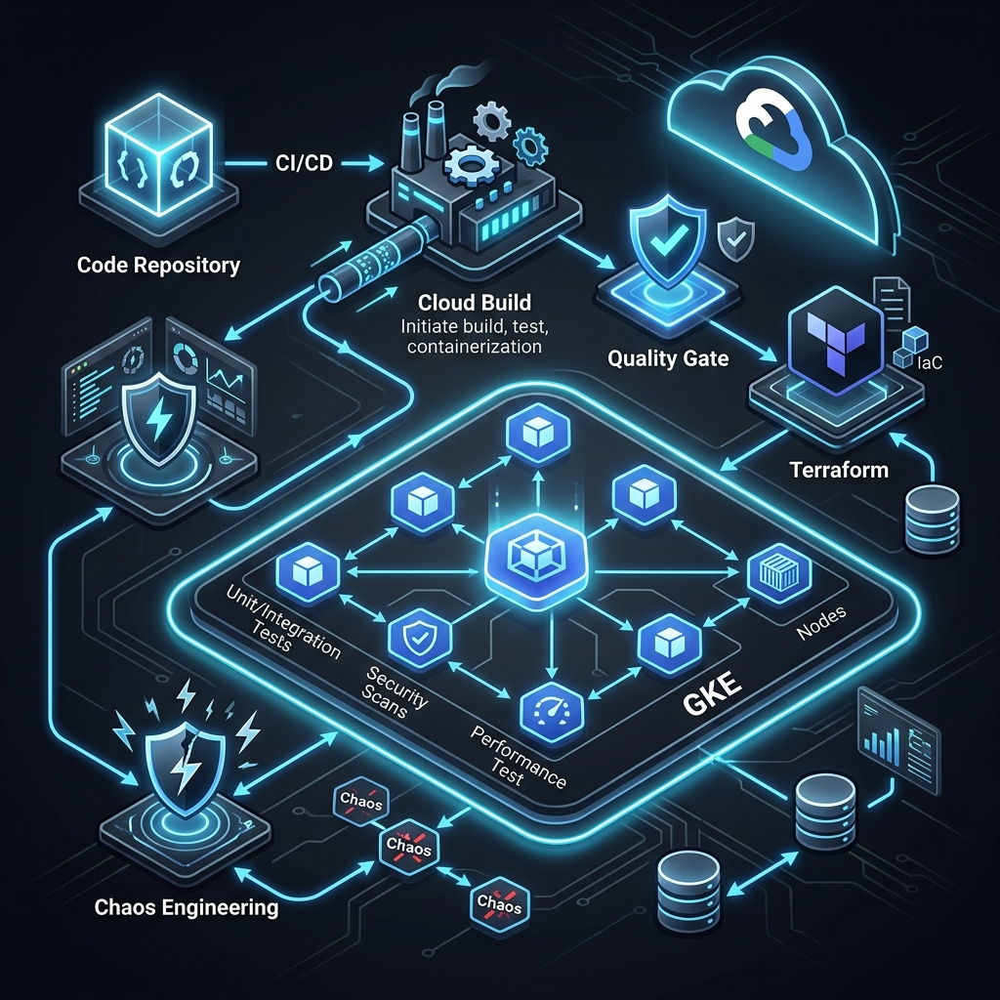

# GCP Quality Engineering Architecture

**Build quality-first cloud modernization on Google Cloud Platform.**



This repository contains **battle-tested frameworks, reference implementations, and tools** for designing and executing QE architecture across GCP modernization programs—from strategy to automation to metrics.

Used by teams across healthcare, finance, and retail to reduce defect escape rates by 80%+ and improve release predictability.


## Strategic Intent

This repository is not just a collection of scripts; it is a **Quality Engineering Blueprint for Cloud Modernization**. 

In the shift from monolithic on-premise systems to Google Cloud, the primary bottleneck is almost always **Confidence**. Teams fear that the speed of the cloud will break the stability of their systems. This architecture addresses that fear by embedding **Automated Trust** into the platform itself—ensuring that every deployment is validated against SLOs, resilience-tested through Chaos Engineering, and performance-guaranteed through shift-left load testing.

## Why this matters

Most cloud modernization programs treat quality as an afterthought:
- ❌ Quality gates added after architecture locks
- ❌ Performance validated in production
- ❌ No measurable SLOs until too late
- ❌ Manual quality work doesn't scale

**This changes that.** We provide:
- ✅ Quality strategy frameworks (by migration type)
- ✅ Automated quality gates (Cloud Build → production)
- ✅ NFR engineering (SLO/SLI, performance, chaos)
- ✅ Measurable outcomes (defect escape, DORA metrics)
- ✅ Ready-to-use templates and implementations

## What's inside

### 📚 **Frameworks & Guides** (Start here)
- **[Quality Strategy for Modernization](docs/01-quality-strategy-for-modernization.md)** — How to approach quality differently by migration type (rehost/replatform/refactor)
- **[NFR Engineering Framework](docs/02-nfr-engineering-framework.md)** — Define, validate, and measure SLOs/SLIs/error budgets
- **[Quality Gates Model](docs/03-quality-gates-model.md)** — Automated gates from PR → CI → release → cutover
- **[Performance Engineering](docs/05-performance-engineering.md)** — Load testing, chaos engineering, baseline validation
- **[Chaos Engineering Playbook](docs/06-chaos-engineering-playbook.md)** — GCP-specific resilience experiments

### 🔧 **Reference Implementations** (Copy & customize)
- **[Cloud Build Quality Gates](reference-implementations/cloudbuild-quality-gates/)** — YAML + Rego policies you can use today
- **[Terraform GCP Baseline](reference-implementations/terraform-gcp-baseline/)** — Secure landing zone modules
- **[k6 Performance Tests](reference-implementations/k6-performance-tests/)** — Load test harness with pass/fail thresholds
- **[Chaos Experiments](reference-implementations/chaos-experiments/)** — Zone failures, latency spikes, network partitions
- **[SLO Monitoring](reference-implementations/slo-monitoring/)** — Terraform + Grafana SLO dashboards

### 🛠️ **Tools** (Execute at scale)
- **[Quality Metrics Dashboard](tools/quality-metrics-dashboard/)** — Real-time visibility into defect escape, DORA metrics
- **[SLO Burn Rate Calculator](tools/slo-burn-rate-calculator/)** — Automated SLO tracking and alerting
- **[Defect Escape Analyzer](tools/defect-escape-analyzer/)** — Correlate defects to quality gate gaps

### 📖 **Service-Specific Guides**
- [GKE Testing Guide](guides/gke-testing-guide.md)
- [Cloud Run Quality Framework](guides/cloud-run-quality-framework.md)
- [Cloud SQL Resilience Testing](guides/cloud-sql-resilience.md)
- [Cloud Build CI/CD Gates](guides/cloud-build-ci-cd-gates.md)

### 📋 **Templates** (Adapt to your program)
- [ADR Template](templates/adr-template.md) — Document architectural decisions
- [NFR Spec Template](templates/nfr-spec-template.md) — Define latency, throughput, availability
- [Test Strategy Template](templates/test-strategy-template.md) — Unit / integration / performance / chaos
- [Prod Readiness Review](templates/prod-readiness-review.md) — Cutover checklist
- [Incident Postmortem](templates/incident-postmortem-template.md) — RCA + prevention

## Quick start

### 1. Understand your migration type
Read **[Quality Strategy for Modernization](docs/01-quality-strategy-for-modernization.md)** (10 min).

Choose: Rehost / Replatform / Refactor

### 2. Define your NFRs
Use **[NFR Spec Template](templates/nfr-spec-template.md)** to define:
- Latency targets (P95, P99)
- Availability SLO (99.5%? 99.95%?)
- Error rate threshold
- Throughput capacity

### 3. Set up quality gates
Copy **[Cloud Build Quality Gates](reference-implementations/cloudbuild-quality-gates/)** to your pipeline.

```yaml
# cloudbuild.yaml
steps:
  - name: 'unit-tests'
  - name: 'security-scan'
  - name: 'performance-test'
  - name: 'deploy-staging'
  - name: 'chaos-validation'
```

### 4. Measure and iterate
Use **[Quality Metrics Dashboard](tools/quality-metrics-dashboard/)** to track:
- Defect escape rate
- DORA metrics (deployment frequency, lead time, change failure rate, MTTR)
- SLO burn rate

## Real-world results

**Retail Modernization (200 VMs → GCP)**
- Defect escape: 40% → 3%
- MTTR: 90 min → 30 min
- Release predictability: 60% → 95%
- Cost: $500K/month on-prem → $350K/month GCP

**Financial Services (Replatform to GKE)**
- Production incidents: 15/month → 1/month
- Test coverage: 40% → 85%
- Performance regression: 0
- Client satisfaction: 7/10 → 9/10

See **[Case Studies](case-studies/)** for details.

## How to use this

1. **Read the frameworks** — Understand the concepts
2. **Use the templates** — Customize for your program
3. **Copy reference implementations** — Adapt to your CI/CD
4. **Use the tools** — Execute and measure
5. **Contribute** — Share your learnings

## Tech stack

- **IaC:** Terraform
- **CI/CD:** Google Cloud Build
- **Policy:** Open Policy Agent (Rego)
- **Load testing:** k6, Locust
- **Chaos engineering:** Chaos Toolkit
- **Observability:** Cloud Monitoring, Cloud Logging, Grafana
- **Languages:** Python, HCL, YAML, Go

## Contributing

We welcome contributions! 

**How to contribute:**
- Add new quality patterns
- Improve reference implementations
- Share case studies (anonymized)
- Report bugs / suggest improvements

See **[CONTRIBUTING.md](CONTRIBUTING.md)** for details.

## License

MIT License — Use freely, attribute appreciated.

## Questions?

- 💬 Open an issue
- 🔗 LinkedIn: [Anandkrshnn](https://www.linkedin.com/in/anandkrshnn/)

---

**Built for engineering leaders who believe quality should be measurable, automated, and integrated into the entire delivery pipeline.**
