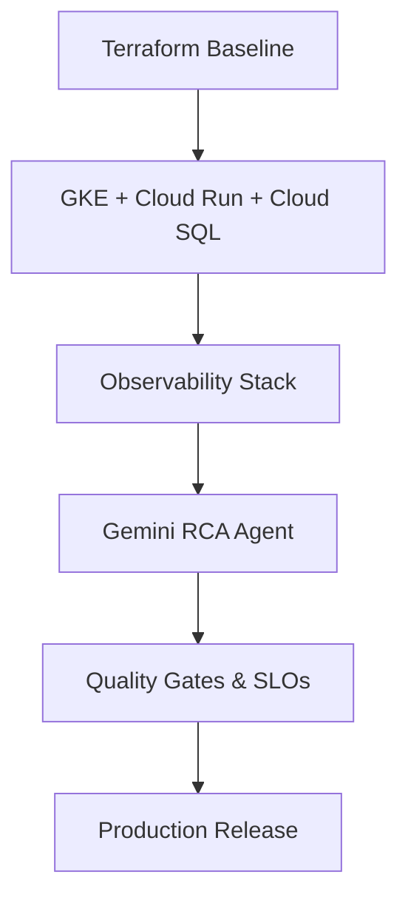
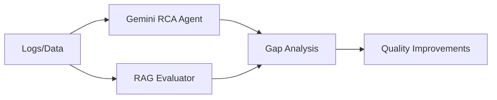

# Architecture Diagrams

## Main QE Workflow

```mermaid
graph TD
    A[Terraform Baseline] --> B[GKE + Cloud Run + Cloud SQL]
    B --> C[Observability Stack]
    C --> D[Gemini RCA Agent]
    D --> E[Quality Gates & SLOs]
    E --> F[Production Release]
```

## AI Quality Framework

```mermaid
graph LR
    A[Logs/Data] --> B[Gemini RCA Agent]
    A --> C[RAG Evaluator]
    B --> D[Gap Analysis]
    C --> D
    D --> E[Quality Improvements]
```
