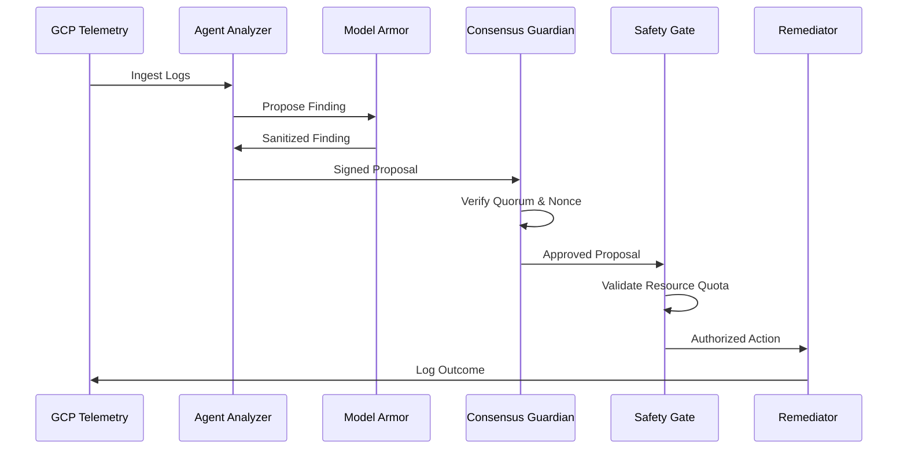

# Architectural Design: Agent Safety Patterns

This document details the high-level architecture of the **Agent Safety Patterns** framework, a reference implementation for secure autonomous operations on Google Cloud.

## Design Philosophy

The architecture is built on the principle of **Defense-in-Depth for AI**. We assume that any single agent can fail, hallucinate, or be compromised. Safety is achieved through collective agreement and deterministic boundaries.

## Core Components

### 1. The Hardened OODA Loop
The system follows the standard Observe-Orient-Decide-Act (OODA) loop, with safety "gates" at each transition:

- **Observe**: Ingests telemetry and logs via Cloud Logging.
- **Orient (Analyzer)**: Vertex AI (Gemini 1.5 Pro) performs root-cause analysis. Output is sanitized by **Model Armor**.
- **Decide (Consensus)**: Independent agents sign the finding. A **Consensus Guardian** verifies the quorum and replay nonces.
- **Act (Remediator)**: A **Safety Gate** validates the action against resource quotas before the final actuator triggers remediation.

### 2. Multi-Agent Consensus Model
We use a **BFT-inspired (Byzantine Fault Tolerance)** quorum model. In this implementation, a 2/3 majority of registered RSA public keys must sign an identical proposal hash. This prevents "Single Point of Hallucination" failures.

### 3. Verification & Attestation
Every decision cycle generates a **Signed Audit Package**. This package contains the original finding, the multi-agent signatures, and the safety gate results. It is written to Cloud Logging, providing a non-repudiable trail for human oversight.

## Infrastructure Blueprint

The architecture is designed to run on a **Hardened GKE Cluster**:
- **VPC Isolation**: Private nodes with no external IP addresses.
- **Workload Identity**: Agents use least-privilege GCP Service Accounts.
- **Vertex AI Private Endpoint**: (Optional) Secure, private communication with AI services.

## Sequence Flow

