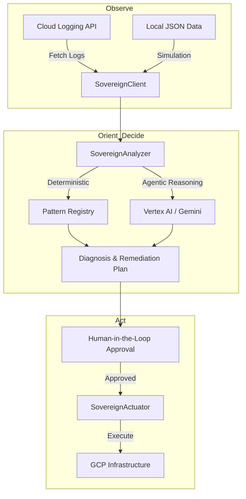

# Sovereign-Core: Architectural Blueprint

This document defines the structural patterns of the GCP Incident Analyzer framework.

## 1. The Agentic OODA Loop
The core engine follows the Observe-Orient-Decide-Act (OODA) loop to provide assisted remediation.

## 2. Component Responsibility

### `SovereignClient` (The SDK Layer)
Responsible for telemetry retrieval. It abstracts the complexity of `google-cloud-logging` and provides a "Simulation Mode" for zero-credential development.

### `SovereignAnalyzer` (The Reasoning Layer)
The "Brain" of the system.
- **Deterministic**: High-speed pattern matching for known failure modes (OOMKill, DNS, Quota).
- **Agentic**: Large Language Model (LLM) reasoning via Vertex AI for complex, multi-service incidents.

### `SovereignActuator` (The Execution Layer)
The "Hands" of the system. Maps high-level remediation plans to concrete CLI commands (`gcloud`, `kubectl`, `terraform`). It enforces a **Dry-Run** safety gate by default.

## 3. Trust Boundary & Security
- **Workload Identity**: The system is designed to run in GKE using IAM Workload Identity to minimize long-lived credential risk.
- **VPC-SC**: Recommended deployment inside a VPC Service Control perimeter to prevent data exfiltration.
- **Model Armor**: Used in production to sanitize LLM inputs/outputs against adversarial prompt injection.
