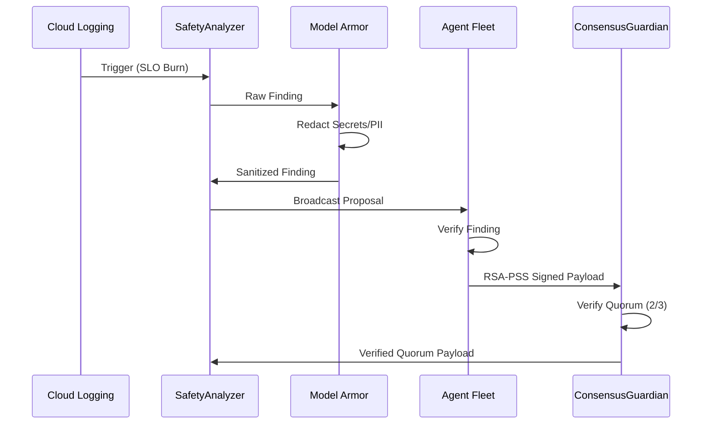
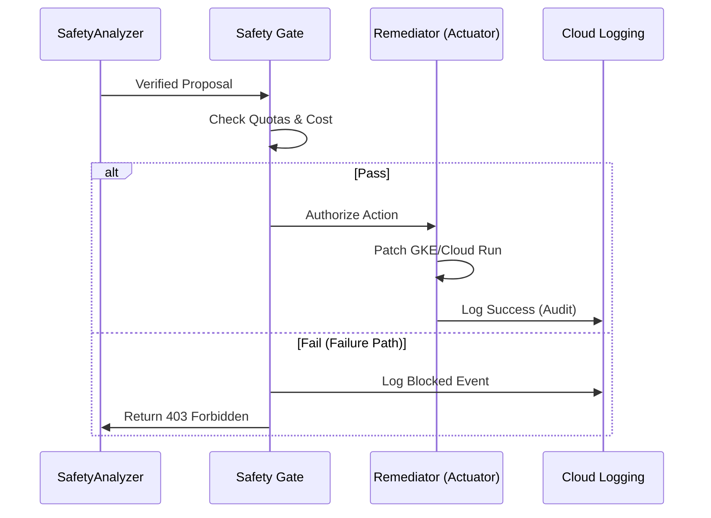

# Enterprise Operational Model & The Golden Path

This document defines the **Operational Specificity** required to run the Agent Safety Framework in a mission-critical environment. It moves beyond "tooling" and into the **constraints and workflows** that ensure architectural integrity.

## 1. The "Golden Path" for Automated Remediation

### A. Delivery Flow (Signal to Consensus)

### B. Governance & Actuation (Consensus to Verification)

## 2. Failure Path Engineering: Control Semantics

A governable architecture is defined by how it handles the edge cases where autonomy fails. We define four **Exceptional States** with explicit actor-trigger-exit conditions and IAM-bound permission boundaries.

| State | Actor | Trigger | Exit Mechanism | Audit Artifact |
| :--- | :--- | :--- | :--- | :--- |
| **Frozen** | Safety Gate | Cost/Quota violation | `SRE_APPROVAL_TOKEN` (via Secret Manager) | `GATE_BLOCK_EVENT` |
| **Force-Apply** | Human SRE | Critical system block | `BREAK_GLASS_IAM_ROLE` (Signed Override) | `SEC_ADMIN_OVERRIDE_LOG` |
| **Quarantine** | Model Armor | > 10% Redaction rate | `GitOps POLICY_COMMIT` (2-Person Review) | `MODEL_QUARANTINE_ALERT` |
| **Fail-Safe** | Consensus | Quorum timeout | `CLOUD_CONSOLE_RESET` (Org Admin only) | `SYSTEM_FAILSAFE_LOCK` |

## 3. Recovery Orchestration & Audit Chains

We distinguish between automated self-healing and mandatory human intervention, ensuring every transition is backed by a non-repudiable audit record.

| Scenario | Automatic Recovery | Human-in-the-Loop | Audit Artifact Chain |
| :--- | :--- | :--- | :--- |
| **Minor SLO Burn** | Scale-up via **RSA-PSS Quorum Payload**. | Observability notification only. | `CONSENSUS_COMPLETE` -> `ACTUATION_SUCCESS` |
| **Rollback Failure** | System Lock (Read-Only mode). | Manual state reconciliation. | `ROLLBACK_FAILURE_ALERT` -> `SRE_INCIDENT_LOG` |
| **Identity Drift** | Automated Key Rotation (30d). | Emergency rotation on leakage. | `SECRET_MANAGER_ROTATION_EVENT` |
| **High-Risk Op** | Proposal generation + Verification. | **Mandatory Console Approval.** | `APPROVAL_REQUEST` -> `IAM_IDENTITY_TOKEN` |

## 4. Automated Rollback Strategy

Autonomous actions are only traceable if they are reversible.
- **State Snapshots**: Before the `Remediator` applies a patch, it stores the **Pre-Action Configuration** in a versioned GCS bucket.
- **Verification Window**: After actuation, the system enters a **10-minute Stabilization Window.** 
    - If the SLO burn rate does not decrease, the system triggers an **Automated Rollback** to the snapshot.
- **Fail-Safe Mode**: If the rollback itself fails, the system triggers a **PagerDuty Escalation** and locks the Safety Gate.

## 3. Human-in-the-Loop (HITL) Approval Gates

Not all actions are suitable for full autonomy.
- **High-Risk Thresholds**: Any remediation with a `GateResult.risk_score > 0.8` (e.g., database schema changes, global traffic shifts) requires a manual approval in the **GCP Console** or via a signed Slack integration.
- **Override Protocol**: SREs can manually "Freeze" the Safety Gate via a single environment variable (`SAFETY_MODE=READ_ONLY`), which immediately suspends all autonomous actuation fleet-wide.

## 4. Multi-Tenancy & Identity Propagation

- **Isolation**: Each business unit (e.g., "Payments," "Search") runs its own **isolated Consensus Plane**. 
- **Identity**: Agents use **OAuth 2.0 scopes** limited strictly to the resources they govern. A "Payments Agent" has zero IAM permissions to view or modify "Search" resources.
- **Source of Truth**: IAM is managed via **Terraform with VPC Service Controls (VPC-SC)** enforced to prevent data exfiltration.

## 5. Reliability Metrics (SLOs)

We measure the Safety Framework with the same rigor as production services:

| SLI | Description | Target |
| :--- | :--- | :--- |
| **Safety Latency** | Time from log event to Actuation pass/fail | < 120s |
| **RCA Accuracy** | % of AI-identified root causes that match human audit | > 85% |
| **False Rejection Rate** | % of safe remediation proposals blocked by the Gate | < 5% |
| **Unauthorized Action Rate** | % of state-changes without valid consensus | **0%** |
