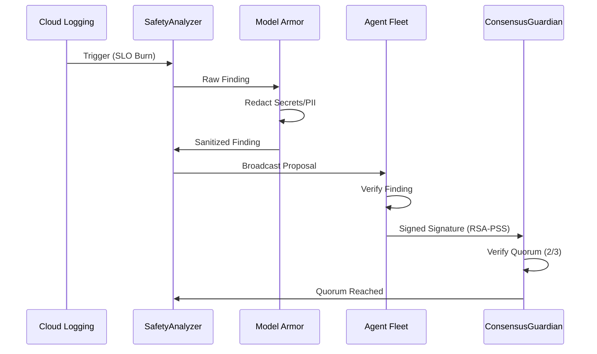
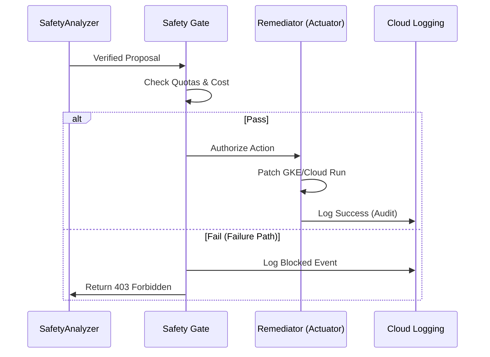

# Enterprise Operational Model & The Golden Path

This document defines the **Operational Specificity** required to run the Agent Safety Framework in a mission-critical environment. It moves beyond "tooling" and into the **constraints and workflows** that ensure architectural integrity.

## 1. The "Golden Path" for Automated Remediation

### A. Delivery Flow (Signal to Consensus)

### B. Governance & Actuation (Consensus to Verification)

## 2. Failure Path Engineering

A mature architecture is defined by how it handles failure.
- **Quorum Failure**: If 2/3 consensus is not reached within 30s, the `ConsensusGuardian` returns a `TIMEOUT` error and the incident is automatically escalated to a human SRE.
- **Safety Gate Block**: If the `SafetyGate` blocks an action (e.g., cost > $50), the system preserves the "Verified Finding" in a **Frozen State** allowing an engineer to "Force-Apply" the action after manual review.
- **Sanitization Fault**: If `ModelArmor` detects a systemic leak (e.g., > 10% of findings redacted), it triggers a **Model-Quarantine** state.

## 2. Automated Rollback & Recovery

Autonomous actions are only "safe" if they are reversible.
- **State Snapshots**: Before the `Remediator` applies a patch, it stores the **Pre-Action Configuration** (canonical JSON) in a versioned GCS bucket.
- **Health Verification Window**: After actuation, the system enters a **10-minute "Stabilization Window."** 
    - If the SLO burn rate does not decrease or if new `CRITICAL` logs appear, the system triggers an **Automated Rollback** to the Pre-Action Snapshot.
- **Fail-Safe Mode**: If the rollback itself fails, the system automatically triggers a **PagerDuty Escalation** and locks the Safety Gate for that specific service.

## 3. Human-in-the-Loop (HITL) Approval Gates

Not all actions are suitable for full autonomy.
- **High-Risk Thresholds**: Any remediation with a `GateResult.risk_score > 0.8` (e.g., database schema changes, global traffic shifts) requires a manual approval in the **GCP Console** or via a signed Slack integration.
- **Override Protocol**: SREs can manually "Freeze" the Safety Gate via a single environment variable (`SAFETY_MODE=READ_ONLY`), which immediately suspends all autonomous actuation fleet-wide.

## 4. Multi-Tenancy & Identity Propagation

- **Isolation**: Each business unit (e.g., "Payments," "Search") runs its own **isolated Consensus Plane**. 
- **Identity**: Agents use **OAuth 2.0 scopes** limited strictly to the resources they govern. A "Payments Agent" has zero IAM permissions to view or modify "Search" resources.
- **Source of Truth**: IAM is managed via **Terraform with VPC Service Controls (VPC-SC)** enforced to prevent data exfiltration.

## 5. Reliability Metrics (SLOs)

We measure the Safety Framework with the same rigor as production services:

| SLI | Description | Target |
| :--- | :--- | :--- |
| **Safety Latency** | Time from log event to Actuation pass/fail | < 120s |
| **RCA Accuracy** | % of AI-identified root causes that match human audit | > 85% |
| **False Rejection Rate** | % of safe remediation proposals blocked by the Gate | < 5% |
| **Unauthorized Action Rate** | % of state-changes without valid consensus | **0%** |
