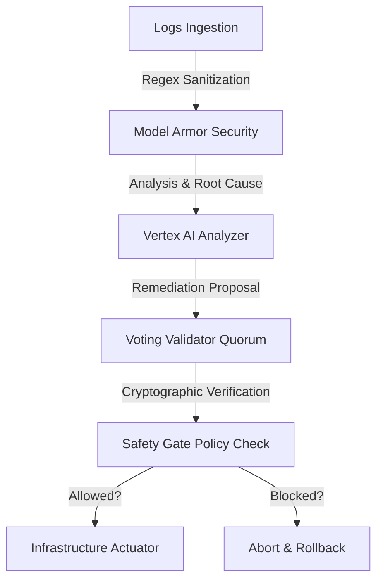

# GCP Incident Analysis Demo

Welcome to the technical portal for the Google Cloud Multi-Agent Incident Analysis demonstration. This project showcases the design and implementation of secure, self-healing agentic architectures on Google Cloud.

## 🎯 The Architectural Thesis
Autonomous operational agents must operate under strict, deterministic guardrails. In modern cloud architecture, self-healing systems must prioritize **verifiability over autonomy**. 

By establishing a zero-trust boundary between the LLM-based incident analyzer and the cloud infrastructure actuators, we ensure that:
1. **Verifiable Quorum**: No operational patch is executed without a cryptographic quorum vote from authorized agent identities.
2. **Deterministic Governance**: All proposed actions must pass immutable safety gate boundaries (quotas, allowed operations) before actuation.
3. **Fail-Closed Posture**: Any validation error, cryptographic mismatch, or timeout results in an immediate execution abort.

---

## 🏛️ System Design Principles

### 1. Verification-First Actuation
Autonomous remediation should never have direct, unmitigated access to infrastructure APIs. In this architecture, agents analyze telemetry logs (such as container OOMs or server errors) and publish proposals. These proposals must be validated by an independent security gate running in a trusted boundary.

### 2. Cryptographic Consensus (Multi-Agent Voting)
Remediations require multi-agent signatures. Authorized agents register public keys, and a majority threshold quorum must cryptographically sign off on the exact canonical payload of the incident proposal before it moves to the execution layer.

### 3. Sanitization (Model Armor)
To protect credentials and sensitive tokens, output streams are filtered locally through regex-based patterns to redact API keys and GCP parameters before telemetries reach downstream modules.

---

## 🚀 Getting Started & The Golden Path

To explore the executable baseline of this pattern, refer to:
* **The Golden Path Simulation**: See [run_golden_path.py](https://github.com/anandkrshnn-ai/gcp-incident-analysis-demo/blob/main/run_golden_path.py) for the primary end-to-end execution simulation.
* **Quick Start Guide**: Run `python run_golden_path.py` locally to generate verification audit trails under `evidence/golden_path_attestation.json`.
