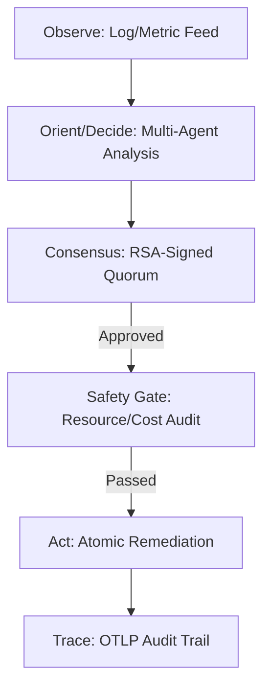

# Agent Safety Patterns: Building Verifiable Autonomy on Google Cloud

**By Anand Krishnan**  
*Research Proof of Concept*

---

### The Problem: The Safety Gap in Agentic AI
In the race to "AI-enable" operations, we have created a significant safety gap. Many agents can "talk" to infrastructure but lack the deterministic guardrails required for production safety. This research PoC explores the architectural patterns needed to provide autonomous agents with verifiable brakes and steering.

### Introducing Agent Safety Patterns (v7.0.0)
This repository provides a **Hardened Reference Framework** for agentic cloud operations. It focuses on **Verifiable Autonomy**—a system where every decision is cryptographically signed and checked against safety boundaries.

---

## The Architecture of Verifiable Autonomy

To build a system that an SRE can trust, we have decoupled safety and security logic into verifiable, cryptographic interfaces.

### 1. The Verified OODA Loop
Our system follows a strict loop: it observes telemetry, Orient/Decides via multi-agent consensus, and Acts only after a final Safety Gate validation.

### 2. Core Safety Pillars
*   **Cryptographic Consensus**: Every remediation proposal must be signed by a majority of authorized agents using RSA-PSS. This prevents a single compromised or hallucinating agent from taking destructive actions.
*   **Deterministic Safety Gates**: Proposals are validated against resource quotas (e.g., max replica count) using strict Pydantic schemas. 
*   **Runtime Attestation**: The system verifies the identity of agent nodes before accepting their contributions to the quorum.
*   **PII Scrubbing**: telemetry is sanitized at the source, ensuring that sensitive data never reaches the reasoning engine.

---

## Lessons from the Research Suite

This architecture was validated through a suite of deterministic tests and simulated incident scenarios.

### Automated Verification
We moved from "Manual Reviews" to **Automated Unit Testing**. Every core safety component is verified for:
1. RSA signature integrity.
2. Quorum calculation accuracy.
3. Safety gate boundary enforcement (rejecting over-quota requests).

### Dealing with Uncertainty
The system is designed to be honest about its limitations. If a quorum cannot be reached or a safety boundary is breached, the system defaults to a **SAFE ABORT** state, providing a full audit trail for human triage.

---

## Why This Matters
This project is an **Engineering Reference** for the next era of Cloud Operations. It demonstrates that we can build autonomous systems that are predictable, observable, and verifiable by design.

**Explore the Research PoC on GitHub: [anandkrshnn-ai/gcp-qe-architecture](https://github.com/anandkrshnn-ai/gcp-qe-architecture)**

---
*This is a research-focused proof-of-concept and is not intended for production use.*
