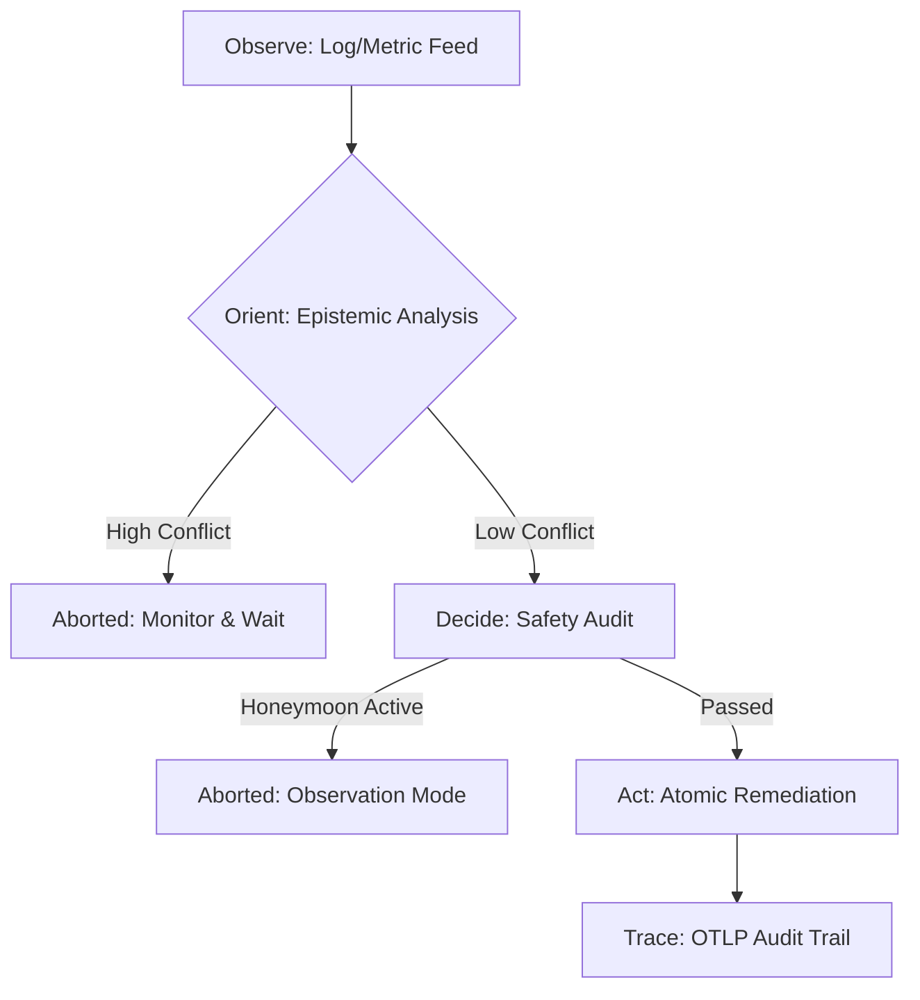

# The Epistemic Engine: Building a 'Self-Healing' Internet on Google Cloud

**By Anand Krishnan**  
*Principal QE Architect*

---

### The Problem: The High Cost of "AI Theater"
In the race to "AI-enable" everything, we have created a dangerous trend: **AI Theater.** We see agents that can "talk" to infrastructure but lack the steering wheels and brakes required for production safety. Currently, a cloud outage costs enterprises upwards of $5,600 per minute. Solving this requires more than just an "AI Wrapper"—it requires a system that understands its own uncertainty.

### Introducing Sovereign-GCP (v0.1.0)
I spent the last few weeks building a **Hardened Reference Framework** for the "Autonomous Cloud." We moved beyond simple automation into **Epistemic Autonomy**—a system that knows what it doesn't know.

---

## The Architecture of Informed Autonomy

To build a system that a Principal Architect trusts, we had to decouple safety and security logic into verifiable, hardware-rooted interfaces.

### 1. The Epistemic OODA Loop
Our system doesn't just "detect and fix." it observes, understands its confidence, and acts only when the risk is quantified.

### 2. The "Hardened" Pillars
*   **Remote Attestation**: Every cycle starts with a hardware-rooted cryptographic handshake (Signed JWT). The agent proves its identity (GKE Sandbox/TEE) before accessing a single log line.
*   **Conflict Scoring**: If logs suggest an OOM but metrics suggest a legitimate Batch Job, the agent identifies the **Conflict** and refuses to act.
*   **DeepScrub PII**: Recursive dictionary scanning ensures that sensitive keys (API_KEY, SSN) are redacted at the source, never reaching the Reasoning Engine.
*   **Platform Awareness**: The engine correlates sibling failures. If the entire "Zone" is failing, the agent enters **Freeze Mode** to prevent local interference with a platform-wide outage.

---

## Adversarial Lessons: How the Engine Was Forged

This architecture wasn't designed in a vacuum. It was forged through **three waves of simulated adversarial review** (the "Principal's Gauntlet").

### Wave 1: From Wrapper to Engine
We realized that a "script" is a liability. We implemented the **SafetyGate** with a "3-Strike" rule to prevent autonomous death spirals.

### Wave 2: Architectural Decoupling
We moved from "Text-File Safety" to **Atomic Persistence** and **Hardware Identity**. We proved that autonomy requires a verifiable Root of Trust.

### Wave 3: The Epistemic Leap
The final breakthrough was **Uncertainty Quantification.** We admitted that the Cloud is probabilistic. By building an engine that detects its own misdiagnoses, we created a system that is safe by design.

---

## Why This Matters
This isn't just a demo; it’s an **Engineering Blueprint** for the next era of Cloud Operations. We’ve moved beyond the hype to build a system that is honest about its limitations, obsessed with security, and observable through every step of the OODA loop.

## Appendix: The Principal’s NFR Layer
To survive real-world chaos, we implemented three mission-critical Non-Functional Requirements:
- **Watermark-Based Alignment**: Solving for **Latency Skew**. We align logs and metrics via event-time watermarks before calculating conflict, ensuring we aren't comparing apples to stale oranges.
- **Exponential Strike Decay**: Solving for **Permanent Freezes**. Mistakes are human (and AI); we allow strikes to "cool down" over time so the system doesn't freeze forever after transient glitches.
- **Stabilization Verification**: Solving for **Flapping**. A repair isn't finished when the command is run. The OODA loop remains in a "Stabilizing" phase for N health cycles to ensure the fix actually held.

It’s a step toward a world where the internet doesn't just "break"—it heals itself with informed, verifiable intelligence.

**Explore the Blueprint on GitHub: [anandkrshnn-ai/gcp-qe-architecture](https://github.com/anandkrshnn-ai/gcp-qe-architecture)**

---
*If you are interested in the technical deep-dive or the adversarial test harness, check out the `ADVERSARIAL_LESSONS.md` in the repository.*
