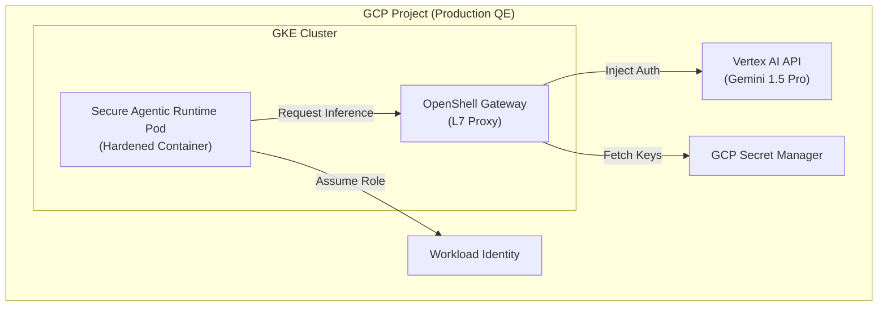

# Secure Agentic Runtime on GCP: Secure Agent Runtimes with GKE and Vertex AI

## Introduction

As we scale **Autonomous Quality Engineering** on Google Cloud, the execution environment for AI agents becomes a critical security boundary. **NVIDIA Secure Agentic Runtime** provides a hardened runtime that perfectly complements the GCP security stack.

This guide outlines how to deploy Secure Agentic Runtime on **Google Kubernetes Engine (GKE)** and integrate it with **Vertex AI** to create a production-grade, policy-governed agent environment.

---

## GCP Reference Architecture

The following architecture leverages GCP-native security controls to harden the Secure Agentic Runtime runtime.

### Logical Flow

1.  **Orchestration**: Secure Agentic Runtime runs as a stateful workload on GKE.
2.  **Identity**: GKE **Workload Identity** allows the Secure Agentic Runtime pod to authenticate to Vertex AI without static API keys.
3.  **Secrets**: **GCP Secret Manager** stores the credentials for non-GCP providers (e.g., NVIDIA NIM, Anthropic).
4.  **Networking**: **VPC Service Controls** ensure that agent data cannot be exfiltrated to unauthorized projects.



---

## Deployment Steps

### 1. Hardened GKE Node Configuration

To support Secure Agentic Runtime's sandboxing requirements (which may involve nested virtualization or specific kernel modules), use **GKE Standard** with a hardened node image.

```bash
gcloud container clusters create qe-agent-runtime \
    --zone us-central1-a \
    --workload-pool=[PROJECT_ID].svc.id.goog \
    --enable-shielded-nodes \
    --image-type=COS_CONTAINERD
```

### 2. Workload Identity Setup

Avoid using static JSON keys. Instead, bind the Kubernetes Service Account to a Google Service Account with Vertex AI permissions.

```bash
# Create the Google Service Account
gcloud iam service-accounts create Secure Agentic Runtime-agent-sa

# Grant Vertex AI User role
gcloud projects add-iam-policy-binding [PROJECT_ID] \
    --member="serviceAccount:Secure Agentic Runtime-agent-sa@[PROJECT_ID].iam.gserviceaccount.com" \
    --role="roles/aiplatform.user"

# Bind to Kubernetes Service Account
gcloud iam service-accounts add-iam-policy-binding \
    Secure Agentic Runtime-agent-sa@[PROJECT_ID].iam.gserviceaccount.com \
    --role="roles/iam.workloadIdentityUser" \
    --member="serviceAccount:[PROJECT_ID].svc.id.goog[Secure Agentic Runtime/Secure Agentic Runtime-sa]"
```

### 3. Secure Agentic Runtime Configuration (Blueprint)

In your Secure Agentic Runtime blueprint, configure the **L7 Proxy** to use Google's Application Default Credentials (ADC).

```yaml
# Secure Agentic Runtime-gcp-blueprint.yaml
runtime:
  type: docker
  image: "nvcr.io/nvidia/openshell/Secure Agentic Runtime-runtime:latest"

proxy:
  provider: google_vertex
  project_id: "[PROJECT_ID]"
  location: "us-central1"
  auth_type: workload_identity
```

---

## Security Hardening with VPC Service Controls

To prevent an autonomous agent from accidentally (or maliciously) exfiltrating sensitive QE data, place the GKE cluster and Vertex AI API inside a **VPC Service Controls (VPC-SC)** perimeter.

*   **Ingress**: Allow only from your CI/CD runners (e.g., GitHub Actions self-hosted runners).
*   **Egress**: Block all external endpoints except for specified inference APIs and your internal Git repository.

---

## Cost Optimization (FinOps)

Running autonomous QE agents can be resource-intensive. Use the following GCP features to optimize costs:

1.  **GKE Spot Instances**: Since Secure Agentic Runtime supports **Snapshot/Restore**, you can run agents on Spot instances. If a node is preempted, the agent's state can be restored on a new node.
2.  **Vertex AI Batch Prediction**: For non-urgent RCA tasks, use batch prediction to save up to 40% on inference costs.
3.  **Vertical Pod Autoscaler (VPA)**: Let GKE automatically adjust the CPU/Memory for Secure Agentic Runtime pods based on the complexity of the agent's tasks.

---

## Conclusion

By deploying **NVIDIA Secure Agentic Runtime** on **GKE**, you combine the agility of autonomous agents with the "defense-in-depth" security of Google Cloud. This architecture ensures that your Quality Engineering intelligence is both powerful and policy-governed.

*Related: [AI-Powered QE Guide](04-ai-powered-quality-engineering.md) | [Security & Compliance Guide](security-qa-guide.md)*
