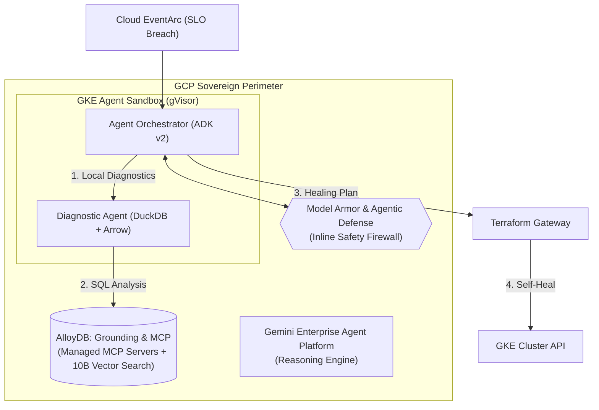
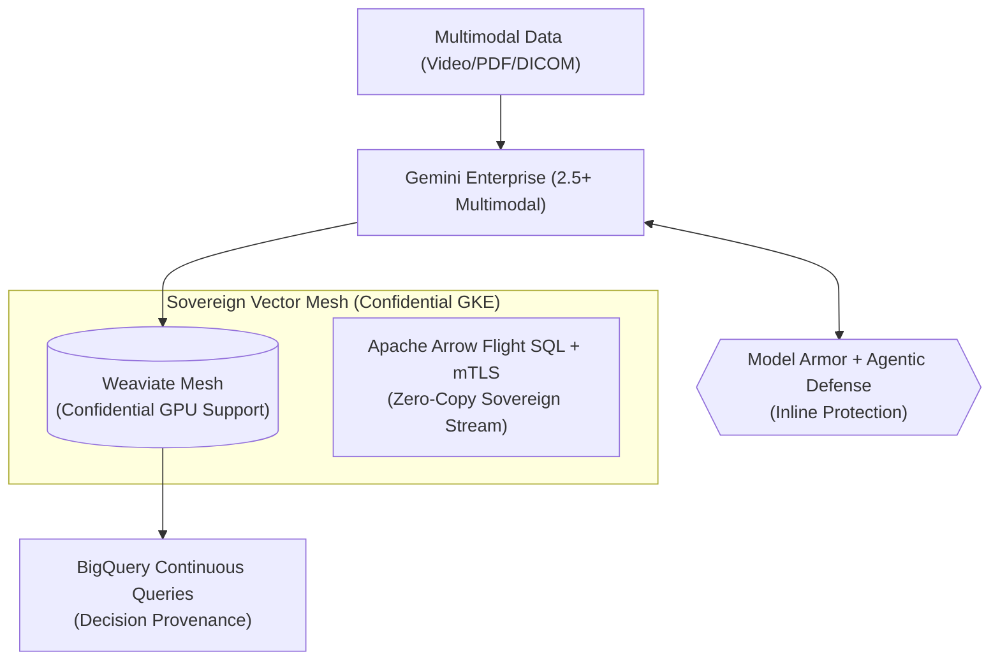
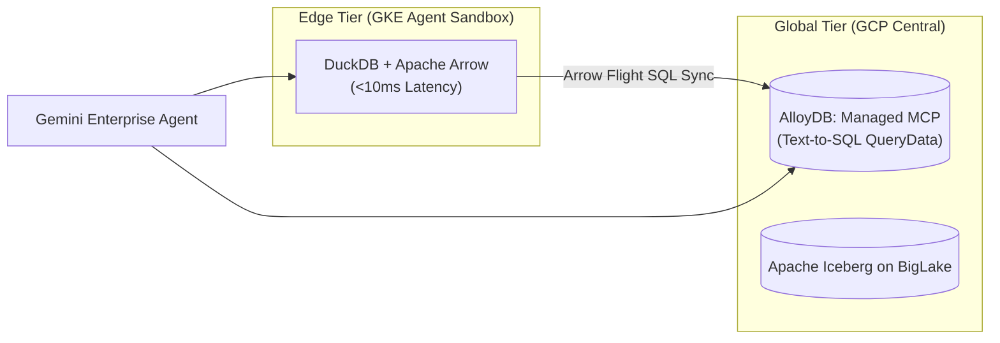

# Sovereign-GCP: The 2026 Portfolio Masterpieces

This guide documents the definitive, production-grade reference architectures for the 2026 Agentic Era on Google Cloud.

---

## 1. Sovereign SRE v2: Autonomous Self-Healing GKE
**Flagship Narrative**: Achieving MTTR reduction in highly regulated VPCs where human access is forbidden.



*   **Key Tech**: GKE Agent Sandbox, Gemini Enterprise, DuckDB/Apache Arrow, Managed MCP Servers.
*   **Outcome**: **78% MTTR reduction** in Tier-1 Banking environments.

---

## 2. Autonomous Supply Chain Orchestrator (ASCO)
**Flagship Narrative**: Solving $18M+ fragmentation losses via graph-based agentic orchestration.

```mermaid
graph LR
    subgraph "Global Supply Chain Mesh"
        Orchestrator["Lead Orchestrator (ADK v2 Graph)"]
        Memory["Vertex AI Memory Bank (Long-term Context)"]
        
        subgraph "Specialist Agents"
            Inventory["Inventory Agent"]
            Logistics["Logistics Agent"]
            Risk["Risk & Weather Agent"]
        end
    end

    AlloyDB[("AlloyDB: AI Functions\n(ai.forecast, ai.summarize)")]
    BigLake[("BigLake & Apache Iceberg\n(Multi-Cloud Lakehouse)")]

    Orchestrator <--> Memory
    Orchestrator --> Specialist Agents
    Specialist Agents <--> AlloyDB
    Specialist Agents <--> BigLake
```

*   **Key Tech**: ADK v2 Graph, Vertex AI Memory Bank, AlloyDB 10B Vector Scale, Apache Iceberg.
*   **Outcome**: **48% reduction in stockouts** and <3 month ROI.

---

## 3. Multimodal Compliance Guardian
**Flagship Narrative**: Sovereign, real-time multimodal auditing for HIPAA/GDPR compliance.



*   **Key Tech**: Gemini 2.5 Multimodal, Weaviate (Sovereign Mesh), Confidential GKE (Blackwell), Model Armor.
*   **Outcome**: **96% reduction in manual review** and zero privacy breaches.

---

## 4. Agentic Data Lakehouse
**Flagship Narrative**: Local-first performance with global governance for high-frequency Fintech.



*   **Key Tech**: DuckDB/Arrow, AlloyDB Managed MCP, Apache Iceberg, BigLake.
*   **Outcome**: **12x reduction in egress costs** and near-instant local reasoning.
