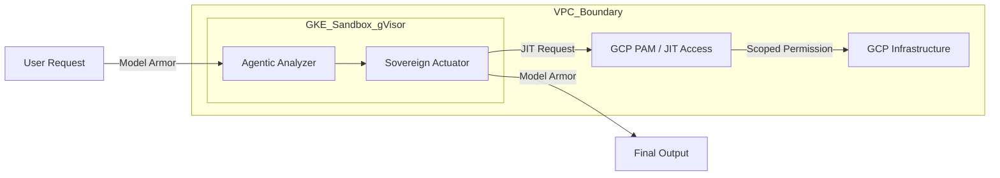

# Secure Agentic Runtime: Secure Agentic Runtime Specification (Advanced)

Secure Agentic Runtime is the "Sovereign Perimeter" for autonomous AI agents. This document defines the advanced implementation of a zero-trust runtime for the `Sovereign-Core` engine.

## 1. Architectural Principles
Secure Agentic Runtime assumes that any agent—whether deterministic or LLM-driven—is a potential attack vector. Security is enforced through **Defense-in-Depth**.

## 2. Advanced Security Layers

### A. Runtime Isolation (gVisor)
All agent execution is confined to **GKE Sandbox**. By using gVisor, we intercept and filter syscalls to the host Linux kernel, preventing "Container Escape" attacks.

### B. Confidential Computing (TEE)
We utilize **Confidential GKE Nodes** (powered by AMD SEV / Intel TDX). This ensures that the agent's memory (containing sensitive logs and reasoning) is encrypted and inaccessible to the cloud provider's host system.

### C. Just-In-Time (JIT) Privileged Access
The `SovereignActuator` does not hold permanent `Editor` or `Owner` roles.
1. The agent detects an incident.
2. It requests **Temporary Permission** for a specific resource via GCP Privileged Access Management (PAM).
3. Upon approval (or automated policy check), the permission is granted for **5 minutes** to execute the remediation.

### D. Model Armor (Interception)
Every prompt sent to Vertex AI and every response returned is passed through a **Model Armor** proxy to detect:
- **Prompt Injection**: Attempts to hijack the agent.
- **Sensitive Data Exfiltration**: Accidental leakage of PII or API keys in the agent's output.

## 3. Provisioning (Terraform Baseline)
The Secure Agentic Runtime runtime is provisioned with a "Secure-by-Default" GKE configuration:
- Private Nodes & Control Plane.
- Shielded GKE Nodes enabled.
- Workload Identity required.
- Binary Authorization enforced.
